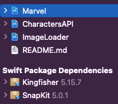
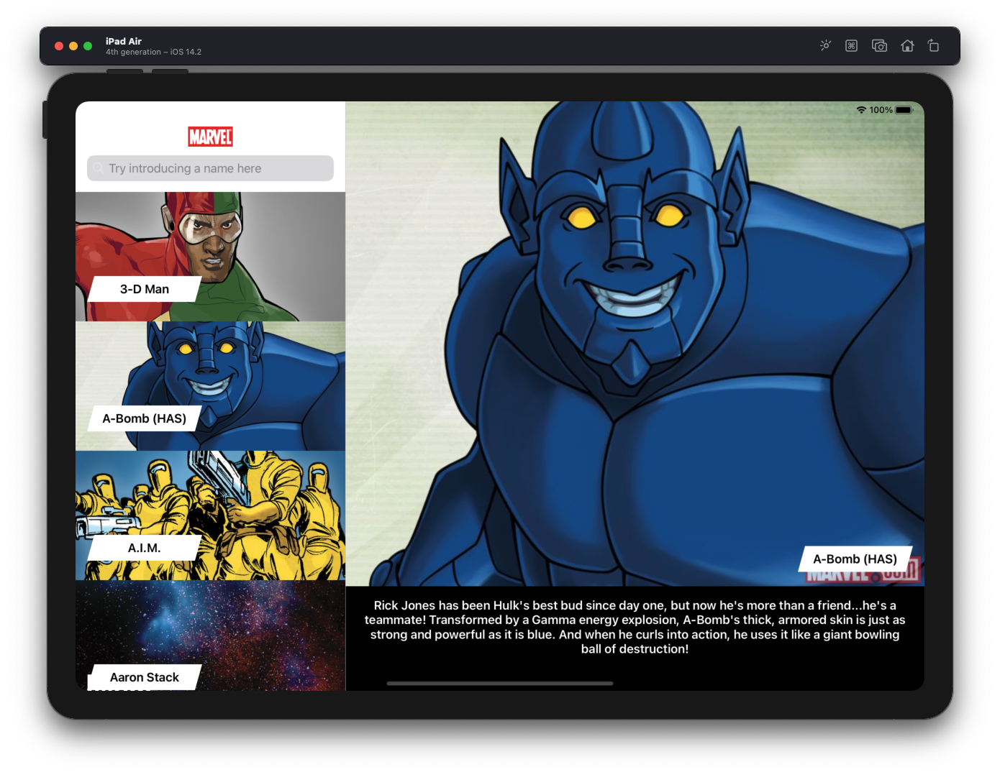
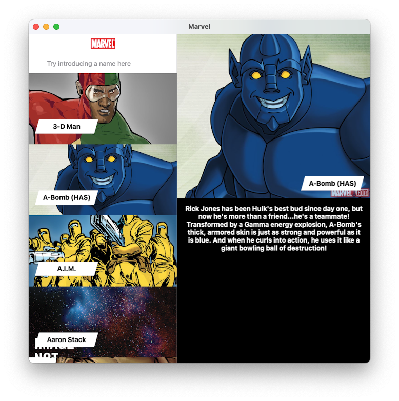

# Marvel

[//]: # "Badges"

[](https://github.com/halonsoluis/CharactersAPI/actions)
[](https://swift.org/blog/swift-5-3-released/)
[](https://sonarcloud.io/dashboard?id=halonsoluis_Marvel)

[//]: # "Info"

Using this app, users will be able to browse through the Marvel library of characters.

- The data is made available thanks to the [Marvel API]

[//]: # "Portfolio"

<!-- Portfolio Gallery Grid -->

<p align="center">


</p>

[//]: # "Features"

This app is able to:

- [x] Communicate with the Public Marvel API.
- [x] See a list/collection of items from the Marvel API.
- [x] Search or filter the contents of this list/collection.
- [ ] See the full details of any item from this list/collection.
  - [X] Image
  - [X] Description
  - [ ] Comics, Series and other collections
- [x] Use the latest Swift version (Swift 5.3)
- [x] The project must use git.

## Architecture

### Initial Approach

As part of the process, an initial and oversimplified overview of the entities was created. This marked the most valuable entities and separation of concerns to take into account, as wells as the boundaries between the components of the app.

<p align="center">

</p>

Of course, this was evolving as the needs of the app were getting more clear. For example, the neeed of callbacks, mixed protocols, avoiding overenginnering, etc.

### Current Architecture

<p align="center">

</p>

Notice that there's an strong dependency from **Marvel** to **CharactersAPI**, this is technical debt that will be addressed.

`MainComposer` Can be extracted out of **Marvel** target, making it to effectively **MarvelUI**. This will then allow for easily interchange of UI technology, hence making easier, for example, the adoption of SwiftUI.

Most of the dependencies between frameworks were resolved in the MainComposer by functions that behave as adapters between frameworks.

### UI Architectural Pattern

MVC was used in previous iteration of the app. Nevertheless, I have come to appreaciate MVVM over it. VIPER has a lot to offer but for the size of this project and at this point, better not to go for a strict approach.

Hence, for current project, learnings from the three of them were applied. I have noticed that I have a preference for compositional architecture and evolutionary design. :)

Basically, the UI interacts with the rest of the app by producing calls to an API provided by the viewModel and listening for changesm. In the case of using **Combine** or **RxSwift** the exposed callback will not be needed, given that `items` is observable

```swift
protocol FeedDataProvider {
    var items: [BasicCharacterData] { get }
    var onItemsChangeCallback: (() -> Void)? { get set }

    func perform(action: Action)
}

enum Action {
    case loadFromStart
    case loadMore
    case openItem(index: Int)
    case search(name: String?)
    case prepareForDisplay(indexes: [Int])
    case setHeroImage(index: Int, on: UIImageView)
}
```

**Start simple, Continue simple, Compose, Repeat**


## Code quality

The app includes static analysis via **Sonarcloud**.
Unit tests and Integration Tests are grouped in a dedicated target **"CI"** that is executed **by Gitlab Actions** on every  and when merging to the **main** branch.

### Process

For the more critical aspects of the app a **Test Driven Development** approach was followed, *with some moments of weakness on which the test was added after instead of before, also a reluctance to test unhappy paths of which I'm not proud*.

- **CharactersAPI** **(93.8% code coverage)**
  - Covered by 20 Unit Tests
  - Covered by 8 Integration Tests
- **ImageLoader** **(100% code coverage)**
  - Covered by 5 Unit Tests
- **Marvel** **(47.6% code coverage)**
  - Covered by 18 Unit Tests
  - Should be covered by Snapshot and UI Tests. *This is not done at this point*

## Usage of Cocoa Touch frameworks

As for allowing deployment on all platforms (iOS, iPadOS, macOS) an approach of creating a Universal App was taken into account.

Nevertheless, as for this point is worth mentioning that I started development of the business logic and the CharactersAPI as a macOS framework. Justification being that compilation+testing is amazingly fast! and for achieving a true separation from UIKit types :P

Of course, this can be achieved with a Cocoa Touch framework that runs on the mac, but for my first time, I didn't wanted to have the temptation. *This caused some issues later on.*

Marvel project's target was then set to iOS and project dependencies updated accordingly.

>For allowing our CI to work it was not possible to select the latest version of iOS. I hope Gitlab updates it fast as *macos-latest* is not really the latest anymore.

## Autolayout usage

For the UI creation the first step was to remove the Storyboard and all references to it. A totally different approach as previous version.

**Snapkit** was decided to be used, mainly for reducing a bit of the hassle of handling autolayout native way of defining constrains. Don't judge me, is way more easy to read and spot issues, also it may be related to that for the last 2 years it has been the way to go in my daily job.

Talking about spotting issues, I started to consider the option to introduce a tool for code injection to facilitate the speed of development (changes in code reflected inmediately in the interface), but as it's a relatively easy interface this idea was desestimated.

## Project structure

The code is presented as a **Workspace** that includes the following **Projects**:

<p align="center">

</p>

- **CharactersAPI**
Includes the Business logic and works as a platform agnostic provider for data retrieved from the Marvel API.

- **ImageLoader**
Protects the rest of the app from the 3rd party library Kingfisher. It could have been solved by using a single file that could work as a facade. It's platform agnostic.

- **Marvel**
Includes UI, ModelViews and the MainComposer. Ideally the MainComposer should be extracted.

## 3rd Party Libraries

Both of the libraries used so far could be easily interchanged or removed in favor of a vanilla solution. Both libraries impact is bigger on more complex projects.

### - [Snapkit]

SnapKit is a DSL to make Auto Layout easy on both iOS and OS X.

### - [Kingfisher]

Kingfisher is a powerful, pure-Swift library for downloading and caching images from the web. It provides you a chance to use a pure-Swift way to work with remote images in your next app.

**SPM is used for handling external dependencies.**

# Extra Features:

- [ ] Performance
  - There are some glitches when new data is received. I would have expected that the DiffableDataSource would make it work. But is not what I see now.
- [x] Universal App

<p align="center">




</p>

- [ ] Use of Size Classes
- [ ] Animations
- [ ] Custom view controller transitions/presentations
- [x] Documentation

[//]: # "Links"

[Marvel API]: http://developer.marvel.com/ "Marvel API"
[Snapkit]: https://github.com/SnapKit/SnapKit "Snapkit"
[Kingfisher]: https://github.com/onevcat/Kingfisher "Kingfisher"